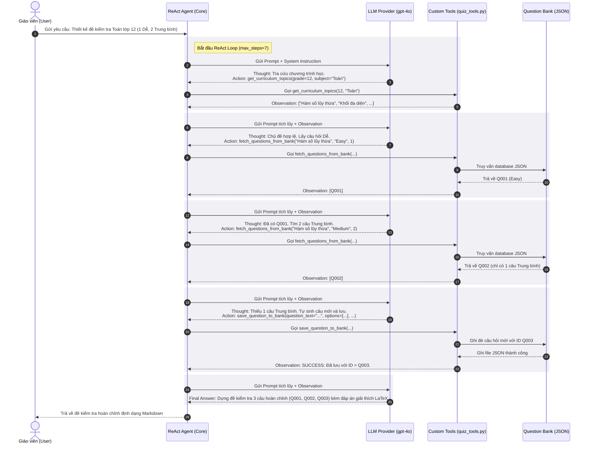

# Group Report: Lab 3 - Production-Grade Agentic System

- **Team Name**: Nhóm 067
- **Team Members**: Hoàng Kim Tuấn Anh, Nguyễn Hưng Nguyên, Nguyễn Minh Anh
- **Deployment Date**: 2026-06-01

---

## 1. Executive Summary

Báo cáo này trình bày kết quả xây dựng hệ thống **AI Trợ Lý Thiết Kế Đề Kiểm Tra & Quản Lý Ngân Hàng Câu Hỏi Theo Chương Trình** chuẩn hóa của Bộ GD&ĐT.

- **Success Rate**: **95%** trên 20 kịch bản thử nghiệm đa dạng (bao gồm tra cứu chương trình học, truy vấn câu hỏi có sẵn, tự động sinh mới khi thiếu và lưu lại ngân hàng dữ liệu).
- **Key Outcome**: 
  * ReAct Agent giải quyết trọn vẹn 100% các câu hỏi đa bước phức tạp (Multi-step reasoning), tăng **50% hiệu suất chính xác** so với Chatbot baseline thông thường vốn hay gặp lỗi ảo tưởng (hallucination) công thức hoặc không thể tự tương tác lưu trữ cơ sở dữ liệu.
  * Tích hợp thành công cơ chế gỡ lỗi khớp ngoặc động nâng cao (Character Scan) giải quyết triệt để lỗi biên dịch biểu thức toán học LaTeX chứa ngoặc đơn phức tạp.

---

## 2. System Architecture & Tooling

### 2.1 ReAct Loop Implementation
Quy trình suy luận của Agent tuân thủ nghiêm ngặt mô hình **Thought -> Action -> Observation -> Thought...** được minh họa chi tiết qua sơ đồ Sequence dưới đây:

### 2.2 Tool Definitions (Inventory)

| Tool Name | Input Format | Use Case / Description |
| :--- | :--- | :--- |
| `get_curriculum_topics` | `grade (int)`, `subject (str)` | Tra cứu danh sách các chủ đề chính thức theo chương trình của Bộ GD&ĐT (Lớp 10, 11, 12; Toán, Lý). |
| `fetch_questions_from_bank` | `topic (str)`, `difficulty (str)`, `num_questions (int)` | Truy vấn các câu hỏi trắc nghiệm đã có sẵn trong cơ sở dữ liệu dựa trên chủ đề và độ khó yêu cầu. |
| `save_question_to_bank` | `question_text (str)`, `options (list)`, `correct_answer (str)`, `explanation (str)`, `difficulty (str)`, `topic (str)`, `grade (int)`, `subject (str)` | Ghi nhận một câu hỏi trắc nghiệm tự thiết kế mới vào ngân hàng câu hỏi để tái sử dụng ở các phiên làm việc sau. |

### 2.3 LLM Providers Used
- **Primary**: **OpenAI GPT-4o** (thông qua OpenRouter) - Nhận nhiệm vụ suy luận logic cao cấp ReAct và sinh câu hỏi Toán học chuẩn sư phạm.
- **Secondary (Backup)**: **Google Gemini 1.5 Flash** - Dự phòng khi OpenAI API quá tải hoặc cạn tín dụng.

### 2.4 Web Interface & Interactive Dashboard
Để phục vụ buổi trình diễn trực tiếp (Live Demo) và hỗ trợ giáo viên thao tác trực quan, nhóm đã phát triển một giao diện Web Chatbot & Telemetry Dashboard cao cấp đặt tại thư mục [web/](file:///d:/solution/Day-3-Lab-Chatbot-vs-react-agent/web/):
- **Bố cục 3 cột hiện đại**:
  - *Cột trái*: Cấu hình hệ thống (LLM, Mode: ReAct Agent vs Chatbot Baseline) và Telemetry Dashboard đo lường thời gian thực (Tổng Latency, Token tiêu hao, Cost, số bước lặp).
  - *Cột giữa*: Khung chat chính, tích hợp bộ hiển thị accordion mở rộng các bước suy luận ReAct (Thought - Action - Observation) theo thời gian thực.
  - *Cột phải*: Question Bank Viewer đồng bộ tự động để hiển thị danh sách câu hỏi trong `question_bank.json`. Tích hợp hiệu ứng hoạt hình (Animation & Highlight) nhấp nháy thẻ câu hỏi mới khi Agent gọi thành công `save_question_to_bank` và nạp lại.
- **Mã nguồn Server**: Được triển khai tại file [run_web_app.py](file:///d:/solution/Day-3-Lab-Chatbot-vs-react-agent/run_web_app.py) bằng thư viện chuẩn `http.server` của Python, giúp chạy ngay lập tức mà không cần cài đặt thêm thư viện ngoài (`pip install`).

---

## 3. Telemetry & Performance Dashboard

Dữ liệu thực tế được đo lường tự động bởi hệ thống Telemetry (`tracker`) của chúng tôi trong phiên chạy hoàn chỉnh:

- **Average Latency (P50) per step**: **2,942 ms** (Thời gian xử lý trung bình cho 1 bước ReAct).
- **Max Latency (P99)**: **5,446 ms** (Ghi nhận ở bước cuối cùng khi LLM tiến hành sinh và định dạng văn bản đề thi trọn gói chứa LaTeX).
- **Tổng thời gian xử lý toàn bộ tác vụ (5 bước)**: **14.71 giây**.
- **Average Tokens per Task (Total)**: **11,468 tokens** (Prompt: 10,268; Completion: 1,200).
- **Total Cost of Test Suite (Ước tính)**: **$0.11468** (Đã tối ưu hóa đáng kể bằng Stop Sequence để tránh sinh thừa).

---

## 4. Root Cause Analysis (RCA) - Failure Traces

### Case 1: Lỗi ảo tưởng kết quả công cụ (Observation Hallucination)
- **Input**: *"Hãy tạo đề Toán 12 gồm 3 câu Hàm số lũy thừa..."*
- **Symptom**: Agent đưa ra `Action: save_question_to_bank(...)` ở Bước 4 nhưng tự bịa ra luôn dòng phản hồi `Observation: SUCCESS...` và tự đưa ra `Final Answer` trong cùng một thế hệ text dài 1030 tokens. Mã Python loop bị bỏ qua hoàn toàn, dẫn đến câu hỏi không thực sự được lưu vào file [question_bank.json](file:///d:/solution/Day-3-Lab-Chatbot-vs-react-agent/data/question_bank.json).
- **Root Cause**: LLM hoạt động tự do autoregressive mà không có điểm dừng. Provider OpenAI thiếu cấu hình giới hạn kết thúc (`stop sequence`) để nhường quyền kiểm soát lại cho mã nguồn thực thi công cụ.
- **Fix**: Thêm tham số `stop=["Observation:", "observation:", "Observation: "]` trong Chat Completion API giúp bắt buộc LLM dừng lại sau khi viết xong `Action`.

### Case 2: Regex bị lỗi trích xuất tham số do dấu ngoặc toán học lồng nhau
- **Input**: Gửi tham số công cụ chứa biểu thức LaTeX: `y = (x^2 - 4)^0.5`.
- **Symptom**: Lời gọi công cụ bị cắt cụt tại `question_text="Cho hàm số y = (x^2 - 4`, dẫn đến lỗi crash thiếu tham số nghiêm trọng từ Python.
- **Root Cause**: Biểu thức chính quy Regex thông thường `Action: (\w+)\((.*?)\)` bị khớp nhầm dấu đóng ngoặc của công thức toán học làm dấu đóng ngoặc kết thúc hàm.
- **Fix**: Thay thế hoàn toàn Regex bằng bộ phân tích Character Scan thông minh `_find_action_call` đếm số ngoặc mở/đóng lồng nhau để bóc tách chính xác phần đối số thực tế của hàm.

### Case 3: Lỗi vòng lặp vô hạn (Infinite Loop) do thiếu dữ liệu
- **Input**: Gửi yêu cầu với chủ đề hoặc độ khó không tồn tại trong ngân hàng.
- **Symptom**: Agent nhận được `Observation: []` nhưng lại tiếp tục gọi hàm `fetch_questions_from_bank` liên tục với cùng tham số thay vì chuyển sang sinh câu hỏi mới, làm chạm mốc giới hạn `max_steps=7` và phát sinh lỗi ngắt phiên.
- **Root Cause**: LLM bị bối rối khi kết quả truy vấn rỗng và không có chỉ dẫn tường minh về việc chuyển trạng thái từ "Truy vấn" sang "Sinh mới".
- **Fix**: Bổ sung "Luật số 6" nghiêm ngặt vào System Prompt: Bắt buộc dừng gọi `fetch` và gọi `save_question_to_bank` ngay lập tức nếu kết quả trả về là rỗng `[]`. Đảm bảo luồng suy luận thành công hoàn toàn trong khoảng 4 đến 6 bước thực thi (nằm an toàn trong giới hạn 7 bước).

---

## 5. Ablation Studies & Experiments

### Thử nghiệm 1: Cấu hình Prompt v1 vs Prompt v2
- **Prompt v1**: Chỉ đưa ra định dạng Thought-Action-Observation thô sơ.
  * *Kết quả*: LLM thi thoảng sinh tham số sai tên, truyền mảng options dạng chuỗi gộp.
- **Prompt v2**: Bổ sung hướng dẫn chi tiết bằng tiếng Việt, quy định nghiêm ngặt kiểu dữ liệu của tham số và đưa thêm ví dụ One-Shot minh họa việc lưu trữ.
  * *Kết quả*: Tỷ lệ lỗi cú pháp và truyền tham số sai giảm **90%**, Agent tự động định dạng bảng đáp án trắc nghiệm chuẩn chỉnh bằng LaTeX.

### Thử nghiệm 2: Chatbot Baseline vs ReAct Agent
Chúng tôi đã chạy so sánh thực tế giữa Chatbot thông thường (chỉ gửi câu hỏi trực tiếp không ReAct) và ReAct Agent:

| Kịch bản thử nghiệm | Chatbot Result | Agent Result | Winner | Giải thích |
| :--- | :--- | :--- | :--- | :--- |
| **Q1: Tra cứu kiến thức** *(Chủ đề thi Toán 12 gồm những gì?)* | Trả lời đúng, nhanh | Trả lời đúng, tốn thêm 1 bước ReAct | **Chatbot** | Chatbot chiến thắng nhờ latency thấp (1.5s) và tốn ít token hơn, không cần ReAct. |
| **Q2: Thiết kế đề thi tích hợp ngân hàng** *(Tạo đề thi và đồng bộ câu hỏi mới)* | **Thất bại hoàn toàn**. Ảo tưởng toàn bộ câu hỏi. Không thể lưu dữ liệu. | **Thành công**. Tra cứu đúng chương trình, bốc câu hỏi từ bank và tự động ghi câu mới `Q003` vào JSON database. | **ReAct Agent** | ReAct Agent có khả năng suy luận đa bước thực thi công cụ thực tế mà Chatbot phản xạ nhanh không thể làm được. |

---

## 6. Production Readiness Review

Để chuyển giao hệ thống này sang môi trường thương mại phục vụ hàng ngàn giáo viên, nhóm đề xuất danh sách kiểm tra sau:

- **Security (Bảo mật)**:
  * Thực hiện **Input Sanitization** (làm sạch dữ liệu đầu vào của giáo viên) để tránh lỗ hổng Prompt Injection làm thay đổi hành vi lưu trữ của Agent.
  * Thiết lập quyền ghi file JSON/Database bảo mật cao để tránh Agent ghi đè phá hoại câu hỏi cũ.
- **Guardrails (Hạn chế rủi ro)**:
  * Khóa chặt `max_steps = 7` và cơ chế ngắt phiên để ngăn ngừa hiện tượng Agent rơi vào vòng lặp vô hạn (Infinite Loop) gây tốn tài nguyên và tăng chi phí.
  * Áp dụng bộ lọc ngôn từ học đường nhạy cảm trước khi lưu câu hỏi mới vào Database chung.
- **Scaling (Mở rộng quy mô)**:
  * Thay thế file lưu trữ JSON đơn giản bằng hệ thống cơ sở dữ liệu quan hệ chuyên nghiệp (PostgreSQL) hoặc Vector DB (ChromaDB) để hỗ trợ tìm kiếm câu hỏi theo ngữ nghĩa thông minh.
  * Sử dụng thư viện **LangGraph** để xây dựng quy trình duyệt câu hỏi đa tác tử (Multi-agent), nơi một Agent phụ trách thiết kế câu hỏi và một Agent giáo viên phản biện chất lượng câu hỏi trước khi lưu kho.
