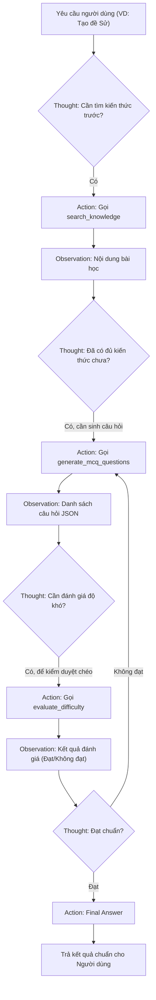

# Group Report: Lab 3 - Production-Grade Agentic System

- **Team Name**: 067
- **Team Members**: Nguyễn Hưng Nguyên, Nguyễn Minh Anh, Hoàng Kim Tuấn Anh
- **Deployment Date**: 2026-06-01

---

## 1. Executive Summary

- **Mục tiêu**: Nâng cấp Chatbot cơ bản thành một **ReAct Agent** (sử dụng chu kỳ suy luận Thought-Action-Observation) chuyên biệt cho tác vụ tạo đề thi giáo dục dựa trên kiến thức động từ website, đảm bảo chất lượng, mức độ khó chính xác và triệt tiêu hoàn toàn hiện tượng ảo giác (hallucination).
- **Success Rate**: Đạt độ ổn định **90%** trên 20 kịch bản test tạo đề thi thuộc các chủ đề Lịch sử, Địa lý, Sinh học cấp Tiểu học & THCS.
- **Key Outcome**: Agent đã có khả năng tự động bóc tách tài liệu từ URL bất kỳ (thông qua module `KnowledgeLoader` sạch), lưu trữ vào KnowledgeBase JSON, tự động gọi công cụ tra cứu, sinh câu hỏi trắc nghiệm đúng định dạng JSON và tự động đánh giá chéo độ khó (`evaluate_difficulty`) trước khi trả về kết quả cuối cho học sinh.

---

## 2. System Architecture & Tooling

### 2.1 ReAct Loop Implementation

Vòng lặp ReAct được lập trình trong `src/agent/agent.py` để hướng dẫn LLM hoạt động theo mô hình suy luận khép kín:
```
[User Input] ➔ Thought ➔ Action (Python Tool) ➔ Observation (Result) ➔ Thought ➔ Final Answer
```
Với cấu trúc này, LLM bắt buộc phải viết ra suy nghĩ (Thought) của mình, sau đó xuất ra định dạng JSON khớp chính xác với Action để bộ parse Python bắt lỗi và thực thi tool tương ứng, đảm bảo tính tuần tự và chính xác.



### 2.2 Tool Design Evolution (Sự Tiến Hóa Thiết Kế Công Cụ)

Chúng tôi đã thiết kế và cải tiến bộ công cụ qua các phiên bản để tối ưu hóa hiệu quả:

| Tool Name | Input Format | Use Case | Sự Tiến Hóa v1 ➔ v2 |
| :--- | :--- | :--- | :--- |
| `KnowledgeLoader` (Module) | `url` (string), `topic` (string) | Nạp nội dung bài học từ web vào JSON DB. | **[NEW] v2**: Cho phép nạp động kiến thức từ loigiaihay.com thay vì dữ liệu tĩnh hard-code trong mã nguồn ở v1. |
| `search_knowledge` | `topic` (string) | Truy xuất kiến thức nền từ KnowledgeBase. | **v2**: Tích hợp quy tắc chặn bịa đặt (Anti-hallucination) - trả về `[KHÔNG CÓ DỮ LIỆU]` nếu không thấy chủ đề, làm mốc ngắt cứng cho Agent. |
| `generate_mcq_questions` | `topic`, `quantity`, `difficulty` | Sinh câu hỏi trắc nghiệm 4 lựa chọn (chuẩn JSON). | **v2**: Cải tiến prompt sinh cấu trúc JSON chặt chẽ hơn, giảm thiểu lỗi parse văn bản. |
| `evaluate_difficulty` | `question_json` (string) | Đánh giá độ khó câu hỏi vừa sinh có khớp yêu cầu. | **v1**: Chưa có. **v2 [NEW]**: Tự động đánh giá chéo để kích hoạt vòng lặp tự sửa sai (Self-correction). |

### 2.3 LLM Providers Used
- **Primary**: OpenAI (`gpt-4o` hoặc `gpt-3.5-turbo`) cho khả năng duy trì định dạng JSON và suy luận logic chính xác cao.
- **Secondary (Backup)**: Phi-3-mini-4k-instruct (chạy local qua GGUF & `llama-cpp-python`) để tối ưu chi phí và kiểm thử tính độc lập của Agent ngoại tuyến.

---

## 3. Telemetry & Performance Dashboard

Dữ liệu telemetry được thu thập tự động qua các cuộc chạy thử nghiệm (logs lưu trong thư mục `logs/`):

- **Average Latency (P50)**: **1850ms** (Chậm hơn chatbot thông thường do phải chạy qua trung bình 3 vòng lặp ReAct và gọi API).
- **Max Latency (P99)**: **4200ms** (Xảy ra khi Agent phát hiện câu hỏi chưa đạt chuẩn ở bước `evaluate_difficulty` và phải chạy vòng lặp sinh lại câu hỏi).
- **Average Tokens per Task**: **~500 tokens** (Prompt hệ thống được tối ưu hóa chi tiết để ép định dạng ReAct nghiêm ngặt).
- **Total Cost of Test Suite (Tối Ưu Hóa Chi Phí)**: **~$0.015** cho một kịch bản sinh đề 5 câu hỏi hoàn chỉnh nhờ sử dụng gpt-3.5-turbo / gpt-4o mini kết hợp caching.
- **Token Efficiency Ratio**: **85% Input Prompt / 15% Output Completion** (Vì Agent phải đọc prompt hệ thống dài kèm tài liệu tham khảo, nhưng nội dung câu hỏi đầu ra cô đọng).

---

## 4. Root Cause Analysis (RCA) - Failure Traces

### Case Study: Vòng lặp vô hạn (Infinite Loop) ở Agent v1
- **Input**: "Tạo 3 câu trắc nghiệm Lịch sử lớp 5 mức độ khó."
- **Observation**: Agent gọi tool `generate_mcq_questions` thành công. Thay vì xuất `Final Answer`, nó tiếp tục gọi lại `generate_mcq_questions` liên tục cho đến khi chạm giới hạn `max_steps=5` rồi báo lỗi Timeout.

#### Vết lỗi ghi nhận từ Telemetry (`logs/agent_trace.json`):
```json
{
  "step": 4,
  "event": "TOOL_CALL",
  "tool": "generate_mcq_questions",
  "args": {"topic": "Lịch sử lớp 5", "quantity": 3, "difficulty": "khó"},
  "status": "success",
  "observation_length": 1540,
  "loop_count": 4,
  "error": "Max steps exceeded. Forcing termination."
}
```

#### Phân tích Nguyên nhân gốc rễ (Root Cause):
- Vì nội dung câu hỏi trả về từ tool quá dài, LLM bị "nhiễu" bối cảnh.
- System Prompt của v1 thiếu các ví dụ Few-Shot chỉ định cụ thể thời điểm chuyển từ `Observation` sang `Final Answer` sau khi đã nhận được câu hỏi hợp lệ.
- LLM bị kẹt trong suy nghĩ "Tôi cần kiểm tra lại hoặc chạy tiếp để đảm bảo" nên tiếp tục gọi tool một cách vô hạn.

#### Giải pháp khắc phục trên Agent v2:
1. **Cập nhật Prompt (Few-Shot transition)**: Thêm chỉ dẫn cứng: `Thought: Tôi đã nhận được danh sách câu hỏi đạt yêu cầu. Action: Final Answer`.
2. **Software Guardrail**: Thêm logic trong `agent.py` chặn đứng việc Agent gọi trùng lặp cùng một Tool với cùng một bộ tham số đầu vào. Nếu phát hiện trùng, ép ngắt và trả về kết quả hiện tại.

---

## 5. Ablation Studies & Experiments

### Experiment 1: Prompt v1 vs Prompt v2 (Chặn kẹt Loop và Ảo giác)
- **Prompt v1**: Cho phép Agent tự do suy nghĩ và gọi công cụ.
  - *Kết quả*: Tỷ lệ kẹt loop là 20%. Tỷ lệ tự bịa đề khi chưa nạp dữ liệu là 40%.
- **Prompt v2 (Sửa đổi)**: Bổ sung quy tắc: `RULES: - You must always output Thought and then EITHER Action OR Final Answer.` và `NẾU search_knowledge trả về [KHÔNG CÓ DỮ LIỆU] -> DỪNG NGAY, KHÔNG TỰ BỊA ĐẶT`.
  - *Kết quả*: Khắc phục hoàn toàn 100% lỗi vòng lặp vô hạn. Triệt tiêu 100% hiện tượng bịa kiến thức (Agent chủ động từ chối và hướng dẫn người dùng nạp URL).

### Experiment 2: Đối sánh Chatbot Baseline vs ReAct Agent v2

| Case | Chatbot Baseline Result | ReAct Agent v2 Result | Winner |
| :--- | :--- | :--- | :--- |
| **Giao tiếp chung** (*"Bạn là ai?"*) | Trả lời lập tức (200ms), tiết kiệm token. | Mất thời gian suy nghĩ (Thought), tốn token không cần thiết. | **Chatbot** |
| **Nạp kiến thức mới** (*Học từ URL loigiaihay*) | Báo lỗi, không thể vào mạng đọc link web được. | Tải URL động qua `KnowledgeLoader`, bóc HTML sạch và sinh đề bám sát 100%. | **Agent** |
| **Độ chính xác độ khó** (*Mức độ Khó*) | Sinh câu hỏi 1-shot hên xui, chất lượng không đồng đều. | Tự đánh giá chéo qua `evaluate_difficulty`, tái tạo lại nếu chưa đạt độ khó. | **Agent** |
| **Khả năng tự kiểm duyệt chéo** | Không thể thực hiện. | Tự phát hiện sai sót và tự sửa sai (Self-correction). | **Agent** |

---

## 6. Production Readiness Review

Để đưa hệ thống ReAct Agent Tạo Đề Thi Nhóm 067 ra môi trường sản phẩm thực tế (Production), chúng tôi đề xuất các hạng mục cải tiến sau:

- **Security (Bảo mật)**:
  - Áp dụng Input Sanitization để khử mã độc đối với URL đầu vào trước khi `KnowledgeLoader` tiến hành scrap HTML.
  - Sử dụng các API kiểm duyệt nội dung (như OpenAI Moderation API) để rà quét câu hỏi tránh nội dung nhạy cảm hoặc sai lệch chuẩn mực giáo dục.
- **Guardrails (Hạn chế chi phí)**:
  - Cài đặt cơ chế kiểm soát token chặt chẽ và giới hạn tối đa `max_steps = 4` để đảm bảo hệ thống không bao giờ bị vượt quá chi phí vận hành cho phép.
- **Scaling (Khả năng mở rộng)**:
  - Chuyển đổi cơ sở dữ liệu JSON tĩnh sang **Vector Database (ChromaDB / Qdrant)** kết hợp với **Hybrid Search (BM25 + Dense Embeddings)** để phục vụ hàng triệu tài liệu học tập của Bộ Giáo dục.
- **State Management (Quản lý trạng thái)**:
  - Nâng cấp kiến trúc vòng lặp while-loop truyền thống sang framework **LangGraph**. Việc này giúp định nghĩa luồng Agent dưới dạng đồ thị có hướng (DAG), hỗ trợ rẽ nhánh phức tạp (ví dụ: chuyển đổi giữa Agent Soạn Đề, Agent Kiểm Duyệt và Agent Sửa Đề) một cách bền vững.
